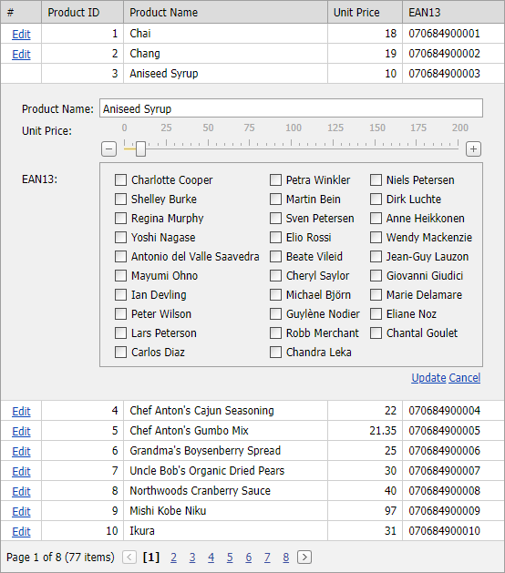

<!-- default badges list -->

<!-- default badges end -->

# Grid View for ASP.NET Web Forms - How to use ASPxTrackBar and ASPxCheckBoxList editors edit form
<!-- run online -->
**[[Run Online]](https://codecentral.devexpress.com/e3804/)**
<!-- run online end -->

This example demonstrates how to add [ASPxCheckBoxList](https://docs.devexpress.com/AspNet/DevExpress.Web.ASPxCheckBoxList) and [ASPxTrackBar](https://docs.devexpress.com/AspNet/DevExpress.Web.ASPxCheckBoxList) to [EditItemTemplate](https://docs.devexpress.com/AspNet/DevExpress.Web.GridViewDataColumn.EditItemTemplate).

## Files to Review

* [Default.aspx](./CS/WebSite/Default.aspx) (VB: [Default.aspx](./VB/WebSite/Default.aspx))
* [Default.aspx.cs](./CS/WebSite/Default.aspx.cs) (VB: [Default.aspx.vb](./VB/WebSite/Default.aspx.vb))
